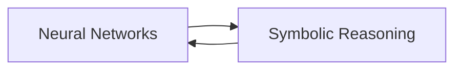

import { Callout, Steps, Step } from "nextra-theme-docs";

# Possible AGI Breakthroughs

In the quest for Artificial General Intelligence (AGI), researchers are exploring various avenues that could lead to significant breakthroughs. While the path to AGI remains uncertain, several key ideas have emerged as potential game-changers in the field.

## Multimodal Learning

One promising approach to AGI is **multimodal learning**, which involves training AI systems on multiple types of data, such as [text, images, audio, and video](/neural-networks-deep-learning). By integrating information from various modalities, AI systems can develop a more comprehensive understanding of the world, similar to how humans learn and perceive their environment.

<Callout>
Multimodal learning could be a crucial step towards achieving AGI, as it enables AI systems to process and reason about complex, real-world data.
</Callout>

## Unsupervised and Self-Supervised Learning

Another potential breakthrough in AGI research is the increasing focus on **unsupervised and self-supervised learning**. These approaches allow AI systems to learn from vast amounts of unlabeled data, discovering patterns and representations without explicit human guidance.

<Steps>

### Step 1
Collect large datasets from diverse sources, such as the internet, sensors, and simulations.

### Step 2
Develop unsupervised and self-supervised learning algorithms that can extract meaningful features and representations from the data.

### Step 3
Use the learned representations as a foundation for more advanced AI tasks, such as reasoning, planning, and decision-making.

</Steps>

By leveraging unsupervised and self-supervised learning, AI systems can acquire a broad base of knowledge and skills, which is essential for achieving AGI.

## Neuro-Symbolic AI

**Neuro-Symbolic AI** is an emerging paradigm that combines the strengths of deep learning and symbolic reasoning. This approach aims to bridge the gap between the pattern recognition capabilities of neural networks and the logical reasoning abilities of symbolic systems.

A Neuro-Symbolic AI system could be represented as follows:

By integrating neural networks and symbolic reasoning, Neuro-Symbolic AI systems can potentially handle complex tasks that require both perception and reasoning, bringing us closer to AGI.

## Continual Learning

**Continual learning**, also known as lifelong learning, is another key area of research in AGI. The goal of continual learning is to develop AI systems that can continuously acquire new knowledge and skills without forgetting previously learned information.

$$Continual Learning = \sum_{i=1}^{n} Knowledge_i$$

where $Knowledge_i$ represents the knowledge acquired at each learning stage $i$.

Continual learning is crucial for AGI, as it enables AI systems to adapt and grow over time, much like humans do throughout their lives. By overcoming the challenges of catastrophic forgetting and knowledge transfer, continual learning could pave the way for more flexible and adaptable AI systems.

## Conclusion

While the path to AGI is still uncertain, researchers are exploring various promising avenues, such as multimodal learning, unsupervised and self-supervised learning, Neuro-Symbolic AI, and continual learning. By combining insights from these areas and pushing the boundaries of AI research, we may eventually achieve the long-sought goal of creating intelligent machines that can think and learn like humans.

For more information on the implications and challenges of AGI, see the [Timelines and Consequences](/artificial-general-intelligence/timelines-consequences) section.