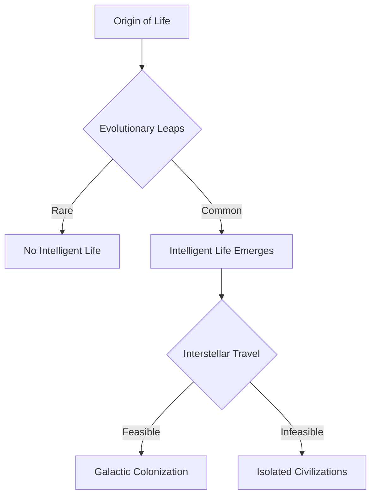

import { Callout, Steps, Step } from "nextra-theme-docs";

# Extraterrestrial Intelligence

In this fascinating discussion, Andrej Karpathy and Lex Fridman delve into the captivating possibility of extraterrestrial intelligence. As AI researchers, they bring a unique perspective to the age-old question: *Are we alone in the universe?*

Andrej shares his thoughts on the likelihood of intelligent alien civilizations existing beyond Earth. He argues that the origin of life may not be as rare as once believed, citing the work of biochemist Nick Lane. If the conditions for life to emerge are more common than previously thought, it suggests that life could be widespread throughout the cosmos.

However, the Fermi paradox looms large: if intelligent life is common, why haven't we detected any signs of it? Andrej proposes a few possible explanations:

<Steps>

### Limited Detection Capabilities

Our current methods for detecting extraterrestrial intelligence, such as radio telescopes, may be insufficient. The vast distances between stars and the limitations of our technology could make it extremely difficult to pick up on signals from alien civilizations.

### Rare Evolutionary Leaps

While simple life may be common, the evolutionary steps needed to give rise to complex, intelligent life might be exceedingly rare. The jump from single-celled organisms to multicellular life, for example, took billions of years on Earth.
</Steps>

Andrej also considers the challenges of interstellar travel, which could limit the ability of advanced civilizations to spread throughout the galaxy. The immense distances and hazards of space, such as cosmic radiation and high-speed collisions with dust particles, may make it impractical for aliens to visit or colonize other star systems.

Despite the challenges, Andrej remains optimistic about the possibility of extraterrestrial intelligence. He encourages listeners to keep an open mind and consider the profound implications of humanity not being alone in the universe.

For more on the potential paths to discovering alien life, check out the [Possible AGI Breakthroughs](/artificial-general-intelligence/possible-agi-breakthroughs) section, which explores how advanced AI could aid in the search for extraterrestrial intelligence.

<Callout emoji="🌌">
The vastness of the universe and the potential for life beyond Earth continue to captivate the human imagination. As our scientific understanding grows and our technological capabilities expand, we may yet find evidence that we are not alone in the cosmos.
</Callout>